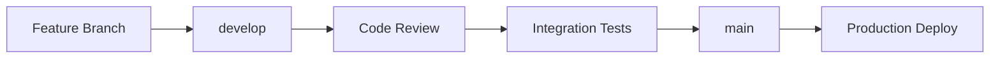

# Deployment Schedule - Automated Meeting Minutes Generator

## Team Member Initials
- **PG** - Team Member (Red avatar)
- **PV** - Team Member (Green avatar)
- **M** - Team Member (Red/Orange avatar)
- **Unassigned** - Avatar with photo (to be assigned)

---

## SCRUM Sprint 0 (Nov 5 - Nov 19) - 9 Work Items

### EPIC 1: MEETING CAPTURE (4 items - IN PROGRESS)

#### SCRUM-12: [US-001] Audio Upload Support
**Status:** IN PROGRESS | **Assignee:** PG | **Story Points:** 5

| File Path | Branch | Notes |
|-----------|--------|-------|
| `src/app.py` (lines 60-116) | `feature/US-001-audio-upload` | POST /api/upload endpoint |
| `src/services/audio_processor.py` (lines 15-60) | `feature/US-001-audio-upload` | save_uploaded_file, validate_audio_file |
| `tests/unit/test_audio_processor.py` (lines 15-45) | `feature/US-001-audio-upload` | Test file upload validation |
| `src/config.py` (lines 50-65) | `feature/US-001-audio-upload` | UPLOAD_FOLDER, MAX_CONTENT_LENGTH config |
| `data/uploads/` | `feature/US-001-audio-upload` | Ensure directory exists |

**Deployment Order:**
1. PG pushes config changes first
2. PG pushes audio_processor service
3. PG pushes app.py endpoint
4. PG pushes tests
5. PG merges to `develop` → code review → merge to `main`

---

#### SCRUM-13: [US-002] Live Meeting Audio Capture
**Status:** IN PROGRESS | **Assignee:** PG | **Story Points:** -

| File Path | Branch | Notes |
|-----------|--------|-------|
| `src/services/audio_processor.py` (new methods) | `feature/US-002-live-capture` | Add real-time audio stream handling |
| `src/app.py` (new WebSocket endpoint) | `feature/US-002-live-capture` | WebSocket /api/live-stream |
| `requirements.txt` | `feature/US-002-live-capture` | Add Flask-SocketIO, pyaudio |
| `tests/integration/test_live_capture.py` (new) | `feature/US-002-live-capture` | Integration tests for streaming |

**Deployment Order:**
1. PG updates requirements.txt
2. PG implements audio_processor streaming methods
3. PG adds WebSocket endpoint in app.py
4. PG adds integration tests
5. PG merges to `develop` → code review → merge to `main`

---

#### SCRUM-15: [US-003] Meeting Metadata Input
**Status:** IN PROGRESS | **Assignee:** PG | **Story Points:** 3

| File Path | Branch | Notes |
|-----------|--------|-------|
| `src/app.py` (lines 84-88) | `feature/US-003-metadata` | Extract metadata from request |
| `src/services/audio_processor.py` (lines 34-40) | `feature/US-003-metadata` | Store metadata in transcript JSON |
| `tests/unit/test_audio_processor.py` (new tests) | `feature/US-003-metadata` | Test metadata validation |

**Deployment Order:**
1. PG updates audio_processor to handle metadata
2. PG updates app.py upload endpoint
3. PG adds tests
4. PG merges to `develop` → code review → merge to `main`

---

#### SCRUM-16: [US-004] High-Accuracy Speech-to-Text Transcription
**Status:** IN PROGRESS | **Assignee:** PV | **Story Points:** 8

| File Path | Branch | Notes |
|-----------|--------|-------|
| `src/services/transcription_service.py` (all) | `feature/US-004-transcription` | Core transcription logic |
| `src/services/assemblyai_transcription.py` | `feature/US-004-transcription` | Alternative provider |
| `src/services/whisper_transcription.py` | `feature/US-004-transcription` | Alternative provider |
| `src/app.py` (lines 118-170) | `feature/US-004-transcription` | POST /api/transcribe endpoint |
| `src/config.py` (lines 20-40) | `feature/US-004-transcription` | Google Cloud credentials |
| `tests/unit/test_transcription_service.py` (new) | `feature/US-004-transcription` | Unit tests |
| `tests/integration/test_api_endpoints.py` (lines 60-95) | `feature/US-004-transcription` | Integration tests |

**Deployment Order:**
1. PV updates config.py with GCP settings
2. PV implements transcription_service.py
3. PV adds alternative providers (assemblyai, whisper)
4. PV adds app.py endpoint
5. PV creates unit tests
6. PV adds integration tests
7. PV merges to `develop` → code review → merge to `main`

---

### EPIC 2: AI-POWERED ANALYSIS (2 items - IN PROGRESS)

#### SCRUM-26: [US-014] Export Minutes (PDF, Markdown, Text)
**Status:** IN PROGRESS | **Assignee:** M | **Story Points:** 3

| File Path | Branch | Notes |
|-----------|--------|-------|
| `src/services/document_generator.py` (lines 41-102) | `feature/US-014-export` | generate_minutes, format handlers |
| `src/services/document_generator.py` (lines 493-534) | `feature/US-014-export` | _generate_pdf |
| `src/services/document_generator.py` (lines 536-580) | `feature/US-014-export` | _generate_markdown |
| `src/services/document_generator.py` (lines 582-616) | `feature/US-014-export` | _generate_text |
| `src/services/document_generator.py` (lines 618-641) | `feature/US-014-export` | _generate_docx |
| `src/app.py` (lines 240-295) | `feature/US-014-export` | POST /api/generate-minutes |
| `src/app.py` (lines 445-468) | `feature/US-014-export` | GET /api/download |
| `requirements.txt` | `feature/US-014-export` | reportlab, python-docx |
| `data/exports/` | `feature/US-014-export` | Ensure directory exists |
| `tests/integration/test_api_endpoints.py` (lines 200-230) | `feature/US-014-export` | Export tests |

**Deployment Order:**
1. M updates requirements.txt
2. M implements document_generator.py (all format handlers)
3. M adds app.py endpoints
4. M creates exports directory
5. M adds integration tests
6. M merges to `develop` → code review → merge to `main`

---

#### SCRUM-28: [US-016] Sync Action Items to Jira/Asana
**Status:** TO DO | **Assignee:** M | **Story Points:** 8

| File Path | Branch | Notes |
|-----------|--------|-------|
| `src/services/integrations.py` (lines 170-382) | `feature/US-016-integrations` | JiraIntegration, AsanaIntegration |
| `src/config.py` (lines 115-130) | `feature/US-016-integrations` | Jira/Asana credentials |
| `requirements.txt` | `feature/US-016-integrations` | python-jira, asana |
| `tests/integration/test_integrations.py` (new) | `feature/US-016-integrations` | Integration tests |

**Deployment Order:**
1. M updates requirements.txt
2. M adds config.py integration settings
3. M implements integrations.py
4. M creates integration tests
5. M merges to `develop` → code review → merge to `main`

---

### EPIC 3: TESTING & QA (2 items)

#### SCRUM-17: [US-005] Speaker Diarization (Up to 8 Speakers)
**Status:** TO DO | **Assignee:** PV | **Story Points:** 8

| File Path | Branch | Notes |
|-----------|--------|-------|
| `src/services/transcription_service.py` (lines 141-147) | `feature/US-005-diarization` | SpeakerDiarizationConfig |
| `src/services/transcription_service.py` (lines 198-250) | `feature/US-005-diarization` | _process_response with speaker tags |
| `src/app.py` (lines 369-407) | `feature/US-005-diarization` | POST /api/update-speakers |
| `src/services/transcription_service.py` (lines 392-432) | `feature/US-005-diarization` | update_speaker_labels |
| `tests/unit/test_transcription_service.py` (new) | `feature/US-005-diarization` | Diarization tests |

**Deployment Order:**
1. PV implements diarization config in transcription_service.py
2. PV adds speaker tagging in _process_response
3. PV adds update_speaker_labels method
4. PV adds app.py endpoint
5. PV creates unit tests
6. PV merges to `develop` → code review → merge to `main`

---

#### SCRUM-30: [US-018] Unit Tests for Transcription Engine
**Status:** TO DO | **Assignee:** M | **Story Points:** 5

| File Path | Branch | Notes |
|-----------|--------|-------|
| `tests/unit/test_audio_processor.py` | `feature/US-018-unit-tests` | Audio processing tests (exists) |
| `tests/unit/test_transcription_service.py` (new) | `feature/US-018-unit-tests` | Transcription service tests |
| `tests/unit/test_gemini_agent.py` | `feature/US-018-unit-tests` | AI agent tests (exists) |
| `.github/workflows/tests.yml` (new) | `feature/US-018-unit-tests` | CI/CD pipeline |

**Deployment Order:**
1. M reviews existing test_audio_processor.py
2. M creates test_transcription_service.py
3. M reviews existing test_gemini_agent.py
4. M adds GitHub Actions workflow
5. M merges to `develop` → code review → merge to `main`

---

#### SCRUM-19: [US-007] Custom Speaker Labeling
**Status:** TO DO | **Assignee:** PV | **Story Points:** 3

| File Path | Branch | Notes |
|-----------|--------|-------|
| `src/app.py` (lines 369-407) | `feature/US-007-speaker-labels` | POST /api/update-speakers endpoint |
| `src/services/transcription_service.py` (lines 392-432) | `feature/US-007-speaker-labels` | update_speaker_labels method |
| `tests/integration/test_api_endpoints.py` (lines 340-365) | `feature/US-007-speaker-labels` | Speaker update tests |

**Deployment Order:**
1. PV implements update_speaker_labels in transcription_service.py
2. PV adds app.py endpoint
3. PV adds integration tests
4. PV merges to `develop` → code review → merge to `main`

---

## SCRUM Sprint 1 (10 Work Items)

### EPIC 1: MEETING CAPTURE (1 item)

#### SCRUM-18: [US-006] Audio Quality Detection & Flagging
**Status:** TO DO | **Assignee:** PG | **Story Points:** 5

| File Path | Branch | Notes |
|-----------|--------|-------|
| `src/services/audio_processor.py` (lines 97-109) | `feature/US-006-quality-check` | Enable quality checking |
| `requirements.txt` | `feature/US-006-quality-check` | Add librosa |
| `src/config.py` (new settings) | `feature/US-006-quality-check` | Quality thresholds |
| `tests/unit/test_audio_processor.py` (new tests) | `feature/US-006-quality-check` | Quality detection tests |

**Deployment Order:**
1. PG updates requirements.txt with librosa
2. PG enables quality checking in audio_processor.py
3. PG adds config settings
4. PG creates tests
5. PG merges to `develop` → code review → merge to `main`

---

### EPIC 2: AI-POWERED ANALYSIS (7 items)

#### SCRUM-20: [US-008] Extract Action Items with AI Agent
**Status:** TO DO | **Assignee:** Unassigned | **Story Points:** 8

| File Path | Branch | Notes |
|-----------|--------|-------|
| `src/services/gemini_agent.py` (lines 88-143) | `feature/US-008-action-items` | extract_action_items method |
| `src/services/gemini_agent.py` (lines 462-490) | `feature/US-008-action-items` | _infer_due_dates helper |
| `src/app.py` (lines 172-238) | `feature/US-008-action-items` | POST /api/analyze endpoint |
| `src/config.py` (lines 70-85) | `feature/US-008-action-items` | Gemini API config |
| `requirements.txt` | `feature/US-008-action-items` | google-generativeai |
| `tests/unit/test_gemini_agent.py` (lines 60-90) | `feature/US-008-action-items` | Action item tests |

**Deployment Order:**
1. Assignee updates requirements.txt
2. Assignee adds config.py Gemini settings
3. Assignee implements extract_action_items in gemini_agent.py
4. Assignee adds _infer_due_dates helper
5. Assignee adds app.py analyze endpoint
6. Assignee creates unit tests
7. Assignee merges to `develop` → code review → merge to `main`

---

#### SCRUM-21: [US-009] Auto-Assign Owners & Due Dates
**Status:** TO DO | **Assignee:** PV | **Story Points:** 8

| File Path | Branch | Notes |
|-----------|--------|-------|
| `src/services/gemini_agent.py` (lines 462-490) | `feature/US-009-auto-assign` | _infer_due_dates logic |
| `src/services/gemini_agent.py` (lines 88-143) | `feature/US-009-auto-assign` | Owner extraction in action items |
| `tests/unit/test_gemini_agent.py` (new tests) | `feature/US-009-auto-assign` | Auto-assignment tests |

**Deployment Order:**
1. PV implements _infer_due_dates with priority-based logic
2. PV enhances owner extraction
3. PV creates comprehensive tests
4. PV merges to `develop` → code review → merge to `main`

---

#### SCRUM-23: [US-011] Detect Implicit Commitments
**Status:** TO DO | **Assignee:** M | **Story Points:** 8

| File Path | Branch | Notes |
|-----------|--------|-------|
| `src/services/gemini_agent.py` (lines 260-307) | `feature/US-011-commitments` | extract_implicit_commitments |
| `src/app.py` (lines 172-238) | `feature/US-011-commitments` | Add to analyze response |
| `tests/unit/test_gemini_agent.py` (lines 120-145) | `feature/US-011-commitments` | Commitment detection tests |

**Deployment Order:**
1. M implements extract_implicit_commitments in gemini_agent.py
2. M integrates into app.py analyze endpoint
3. M creates unit tests
4. M merges to `develop` → code review → merge to `main`

---

#### SCRUM-24: [US-012] Generate Executive Summary
**Status:** TO DO | **Assignee:** Unassigned | **Story Points:** 5

| File Path | Branch | Notes |
|-----------|--------|-------|
| `src/services/gemini_agent.py` (lines 309-364) | `feature/US-012-exec-summary` | generate_executive_summary |
| `src/app.py` (lines 172-238) | `feature/US-012-exec-summary` | Add to analyze response |
| `tests/unit/test_gemini_agent.py` (lines 150-175) | `feature/US-012-exec-summary` | Summary generation tests |

**Deployment Order:**
1. Assignee implements generate_executive_summary
2. Assignee integrates into analyze endpoint
3. Assignee creates tests
4. Assignee merges to `develop` → code review → merge to `main`

---

#### SCRUM-25: [US-013] Generate Professional Minutes (MRS, MTQP, MSAD)
**Status:** TO DO | **Assignee:** Unassigned | **Story Points:** 5

| File Path | Branch | Notes |
|-----------|--------|-------|
| `src/services/document_generator.py` (lines 104-208) | `feature/US-013-templates` | _generate_mrs_content |
| `src/services/document_generator.py` (lines 210-286) | `feature/US-013-templates` | _generate_mtqp_content |
| `src/services/document_generator.py` (lines 288-338) | `feature/US-013-templates` | _generate_msad_content |
| `src/app.py` (lines 240-295) | `feature/US-013-templates` | Add template parameter |
| `tests/integration/test_api_endpoints.py` (new tests) | `feature/US-013-templates` | Template generation tests |

**Deployment Order:**
1. Assignee implements all three template methods
2. Assignee adds template selection to app.py
3. Assignee creates integration tests for each template
4. Assignee merges to `develop` → code review → merge to `main`

---

#### SCRUM-27: [US-015] Action Item Tracking Dashboard
**Status:** TO DO | **Assignee:** M | **Story Points:** 8

| File Path | Branch | Notes |
|-----------|--------|-------|
| `src/services/document_generator.py` (lines 307-310) | `feature/US-015-dashboard` | MSAD template dashboard |
| `templates/dashboard.html` (new) | `feature/US-015-dashboard` | Dashboard UI |
| `src/app.py` (new endpoint) | `feature/US-015-dashboard` | GET /api/dashboard |
| `static/css/dashboard.css` (new) | `feature/US-015-dashboard` | Dashboard styles |
| `static/js/dashboard.js` (new) | `feature/US-015-dashboard` | Dashboard interactivity |

**Deployment Order:**
1. M creates dashboard.html template
2. M adds CSS and JavaScript
3. M implements dashboard endpoint in app.py
4. M integrates MSAD template data
5. M merges to `develop` → code review → merge to `main`

---

#### SCRUM-29: [US-017] Calendar Integration (Google/Outlook)
**Status:** TO DO | **Assignee:** PV | **Story Points:** 5

| File Path | Branch | Notes |
|-----------|--------|-------|
| `src/services/integrations.py` (lines 28-167) | `feature/US-017-calendar` | GoogleCalendarIntegration |
| `src/services/integrations.py` (new class) | `feature/US-017-calendar` | OutlookCalendarIntegration |
| `src/config.py` (new settings) | `feature/US-017-calendar` | Calendar API credentials |
| `requirements.txt` | `feature/US-017-calendar` | google-auth-oauthlib, O365 |
| `tests/integration/test_calendar.py` (new) | `feature/US-017-calendar` | Calendar integration tests |

**Deployment Order:**
1. PV updates requirements.txt
2. PV adds config settings
3. PV implements GoogleCalendarIntegration
4. PV implements OutlookCalendarIntegration
5. PV creates integration tests
6. PV merges to `develop` → code review → merge to `main`

---

### EPIC 3: TESTING & QA (2 items)

#### SCRUM-32: [US-020] Integration Tests for API Endpoints
**Status:** TO DO | **Assignee:** M | **Story Points:** 8

| File Path | Branch | Notes |
|-----------|--------|-------|
| `tests/integration/test_api_endpoints.py` | `feature/US-020-integration-tests` | All endpoint tests (exists) |
| `.github/workflows/integration-tests.yml` (new) | `feature/US-020-integration-tests` | CI/CD integration tests |
| `tests/integration/test_error_handling.py` (new) | `feature/US-020-integration-tests` | Error case tests |

**Deployment Order:**
1. M reviews existing test_api_endpoints.py
2. M adds error handling tests
3. M creates GitHub Actions workflow
4. M merges to `develop` → code review → merge to `main`

---

#### SCRUM-33: [US-021] System Tests for Complete User Workflows
**Status:** TO DO | **Assignee:** M | **Story Points:** 8

| File Path | Branch | Notes |
|-----------|--------|-------|
| `tests/integration/test_api_endpoints.py` (lines 274-329) | `feature/US-021-system-tests` | End-to-end workflow test |
| `tests/system/test_complete_workflow.py` (new) | `feature/US-021-system-tests` | Full system tests |
| `tests/system/test_performance.py` (new) | `feature/US-021-system-tests` | Performance tests |

**Deployment Order:**
1. M creates system test directory
2. M implements complete workflow tests
3. M adds performance benchmarking
4. M merges to `develop` → code review → merge to `main`

---

## Backlog (2 Work Items)

### EPIC 2: AI-POWERED ANALYSIS (1 item)

#### SCRUM-22: [US-010] Summarize Agenda Coverage & Open Questions
**Status:** TO DO | **Assignee:** Unassigned | **Story Points:** 5

| File Path | Branch | Notes |
|-----------|--------|-------|
| `src/services/gemini_agent.py` (lines 183-219) | `feature/US-010-agenda-coverage` | extract_key_topics with coverage |
| `src/services/gemini_agent.py` (lines 221-258) | `feature/US-010-agenda-coverage` | extract_open_questions |
| `src/app.py` (lines 172-238) | `feature/US-010-agenda-coverage` | Add to analyze response |
| `tests/unit/test_gemini_agent.py` (new tests) | `feature/US-010-agenda-coverage` | Coverage analysis tests |

**Deployment Order:**
1. Assignee implements extract_key_topics
2. Assignee implements extract_open_questions
3. Assignee integrates into analyze endpoint
4. Assignee creates tests
5. Assignee merges to `develop` → code review → merge to `main`

---

### EPIC 3: TESTING & QA (1 item)

#### SCRUM-31: [US-019] Unit Tests for AI Agent Extraction Logic
**Status:** TO DO | **Assignee:** Unassigned | **Story Points:** 5

| File Path | Branch | Notes |
|-----------|--------|-------|
| `tests/unit/test_gemini_agent.py` | `feature/US-019-ai-unit-tests` | AI agent tests (exists) |
| `tests/unit/test_gemini_prompts.py` (new) | `feature/US-019-ai-unit-tests` | Prompt engineering tests |
| `tests/unit/test_gemini_parsing.py` (new) | `feature/US-019-ai-unit-tests` | JSON parsing tests |

**Deployment Order:**
1. Assignee reviews existing test_gemini_agent.py
2. Assignee creates prompt engineering tests
3. Assignee creates JSON parsing tests
4. Assignee merges to `develop` → code review → merge to `main`

---

## Branch Naming Convention

```
feature/US-XXX-short-description
```

Examples:
- `feature/US-001-audio-upload`
- `feature/US-008-action-items`
- `feature/US-020-integration-tests`

---

## Deployment Workflow

### Standard Git Flow



### Steps:
1. **Developer creates feature branch** from `develop`
2. **Developer implements feature** following file order above
3. **Developer runs local tests** (unit + integration)
4. **Developer pushes to feature branch**
5. **Create Pull Request** to `develop`
6. **Code Review** by team lead or peer
7. **CI/CD runs automated tests** (GitHub Actions)
8. **Merge to develop** after approval
9. **Regression testing** on develop
10. **Merge develop → main** for production deployment

---

## Priority Order (Cross-Sprint Dependencies)

### Must Complete First (Foundation)
1. **SCRUM-12** (Audio Upload) - Required for all audio features
2. **SCRUM-16** (Speech-to-Text) - Required for all transcription features
3. **SCRUM-20** (Extract Action Items) - Required for integrations

### Can Work in Parallel
- **SCRUM-15** (Metadata) + **SCRUM-17** (Diarization)
- **SCRUM-26** (Export) + **SCRUM-24** (Executive Summary)
- **SCRUM-30** (Unit Tests) + **SCRUM-32** (Integration Tests)

### Depends on Multiple Items
- **SCRUM-28** (Jira/Asana Sync) - Requires SCRUM-20 (Action Items)
- **SCRUM-29** (Calendar Integration) - Requires SCRUM-20 (Action Items)
- **SCRUM-33** (System Tests) - Requires all features complete

---

## Team Assignments Summary

| Team Member | Sprint 0 Tasks | Sprint 1 Tasks | Total Story Points |
|-------------|----------------|----------------|-------------------|
| **PG** | SCRUM-12, 13, 15 | SCRUM-18 | 13+ |
| **PV** | SCRUM-16, 17 | SCRUM-21, 29 | 29 |
| **M** | SCRUM-26, 28, 30 | SCRUM-23, 27, 32, 33 | 48 |
| **Unassigned** | SCRUM-19 | SCRUM-20, 24, 25 | 21 |
| **Backlog** | - | SCRUM-22, 31 | 10 |

---

## Notes

1. **Always create feature branches from `develop`**, never from `main`
2. **Run tests locally before pushing** to avoid CI failures
3. **Update requirements.txt first** when adding new dependencies
4. **Never commit secrets or API keys** - use environment variables
5. **Follow file push order** to avoid dependency errors
6. **Tag commits with Jira ticket number** (e.g., "SCRUM-12: Implement audio upload")
7. **Create small, atomic commits** rather than large monolithic commits
8. **Rebase feature branches** regularly to stay up to date with develop
9. **Delete feature branches** after merging to keep repo clean
10. **Production deploys only from main** - never deploy from develop or feature branches

---

## CI/CD Pipeline Status

### Required GitHub Actions Workflows
- [ ] `.github/workflows/unit-tests.yml` - Run on every push
- [ ] `.github/workflows/integration-tests.yml` - Run on PR to develop
- [ ] `.github/workflows/deploy-staging.yml` - Deploy develop to staging
- [ ] `.github/workflows/deploy-production.yml` - Deploy main to production

**Assignee:** M (SCRUM-30, SCRUM-32)

---

## Questions or Issues?

Contact: Team Lead or Product Owner
Last Updated: 2025-11-07
